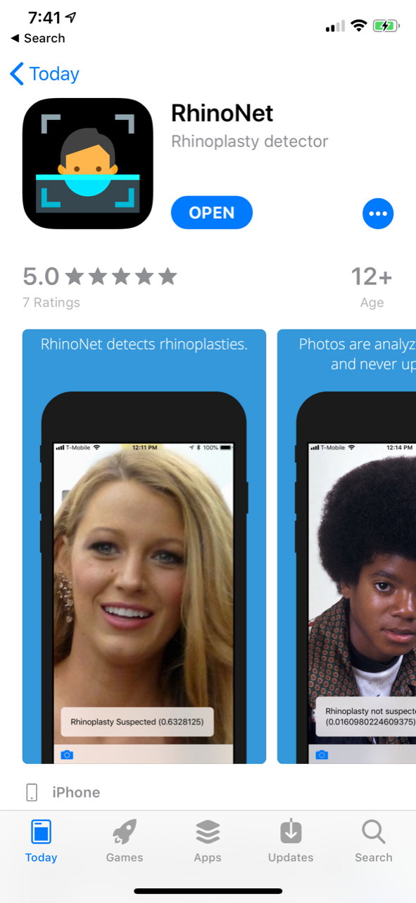

# RhinoplastyNet

The following repository contains source code for:

- model training, evaluation, and conversion (`/model/`)
- data-analysis (`/analysis/`)
- iOS application (`/ios-app/`)

## Predicting Rhinoplasty with Applications of Deep Learning

### Background
Recent advances in deep learning (DL) and artificial intelligence (AI) have been transformative in computer vision and natural language processing, as well as in other domains like radiology, genomics, and pharmaceutical research. We present a novel application of deep learning to the field of plastic surgery. Our goal was to demonstrate a concrete example of a deep neural network, deployed in the form of a mobile application, that classifies rhinoplasty status from an image. 
### Methods
A deep convolutional neural network called “RhinoNet,” was developed to classify rhinoplasty images using only pixels and rhinoplasty status labels (“before”/“after”) as inputs. RhinoNet was trained using a dataset of 22,686 before and after photos which were collected from the public web. The network's performance was tested against plastic surgery attendings and residents on 2,269 previously unseen test-set images.
### Results 
RhinoNet correctly predicted rhinoplasty status in 85% of the test-set images. Sensitivity and specificity of model predictions were 0.840 (0.79-0.89) and 0.826 (0.77-0.88), respectively; the corresponding values for expert consensus predictions were 0.814 (0.76-0.87) and 0.867 (0.82-0.91). RhinoNet and human experts performed equivalently as differences in sensitivity and specificity, along with PPV and NPV, were not statistically significant. 
### Conclusion
Our study demonstrates the potential of applied DL to perform and augment clinical tasks on par with plastic surgery trained experts. We find that DL is especially well suited for unstructured, high fidelity visual and auditory data that does not lend itself to classical statistical analysis. As we demonstrated in the form of a mobile application, DL methods are not just theoretical but can be deployed and used in today’s clinical practice. We expect DL to play a key role in the advancement of many areas of plastic surgery including: predicting wound healing outcomes, optimizing operative techniques for symmetry and aesthetics, early skin cancer detection, and free flap monitoring. 

## Authors

- [Emily Borsting](https://github.com/emilyborsting)
- [Robert DeSimone](https://github.com/desimone)
- [Mustafa Ascha](https://github.com/mustafaascha)
- [Mona Ascha](https://github.com/mxa256)

## Screenshot

## Paper

Soon!

## License

Code is licensed under the Apache 2 license. See the LICENSE for more details.